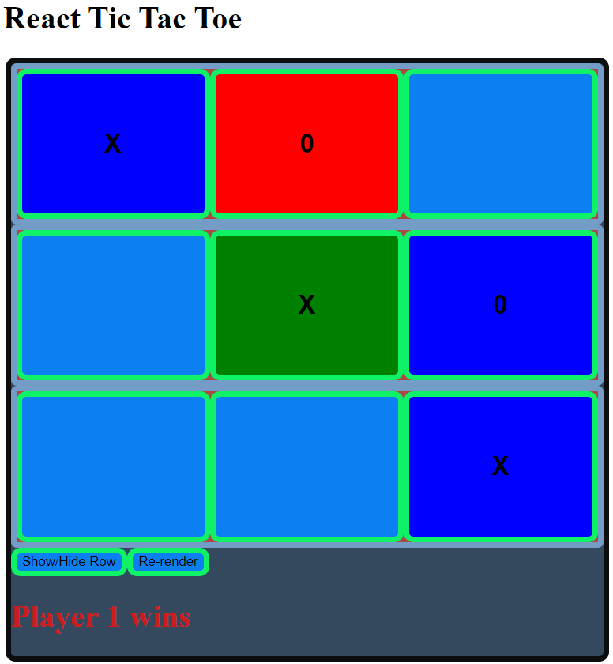

# Tic-Tac-Toe
## Tic-Tac-Toe Exercise
 
This is a Tic-Tac-Toe game. Two players compete (player O and player X) to win by creating a line in any direction. This exercise demonstrates my ability to create a game in React. To run this on your machine, download the files, type http-server -c-1 on your terminal, and go to http://localhost:8080. 
Roadmap of Future Improvements: Additional functionality that would be helpful to a user for future iterations would be to add a history of winnings to the board so as to see who is better at the game overall: O or X. Another feature would be an option for each player to select a specific background color that further identifies them.

MIT License Copyright (c) 2023 Yvette Watson

Permission is hereby granted, free of charge, to any person obtaining a copy of this software and associated documentation files (the "Software"), to deal in the Software without restriction, including without limitation the rights to use, copy, modify, merge, publish, distribute, sublicense, and/or sell copies of the Software, and to permit persons to whom the Software is furnished to do so, subject to the following conditions:

The above copyright notice and this permission notice shall be included in all copies or substantial portions of the Software.

THE SOFTWARE IS PROVIDED "AS IS", WITHOUT WARRANTY OF ANY KIND, EXPRESS OR IMPLIED, INCLUDING BUT NOT LIMITED TO THE WARRANTIES OF MERCHANTABILITY, FITNESS FOR A PARTICULAR PURPOSE AND NONINFRINGEMENT. IN NO EVENT SHALL THE AUTHORS OR COPYRIGHT HOLDERS BE LIABLE FOR ANY CLAIM, DAMAGES OR OTHER LIABILITY, WHETHER IN AN ACTION OF CONTRACT, TORT OR OTHERWISE, ARISING FROM, OUT OF OR IN CONNECTION WITH THE SOFTWARE OR THE USE OR OTHER DEALINGS IN THE SOFTWARE.
